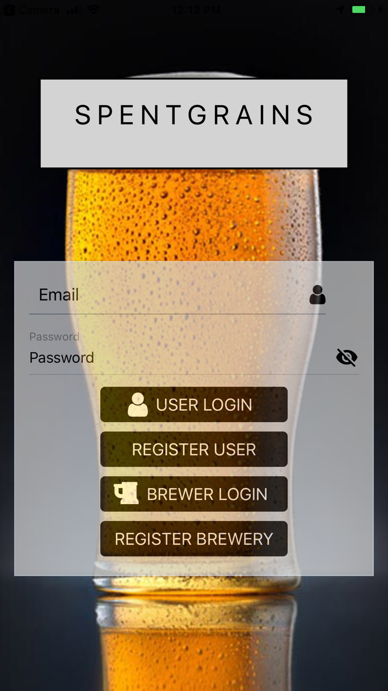
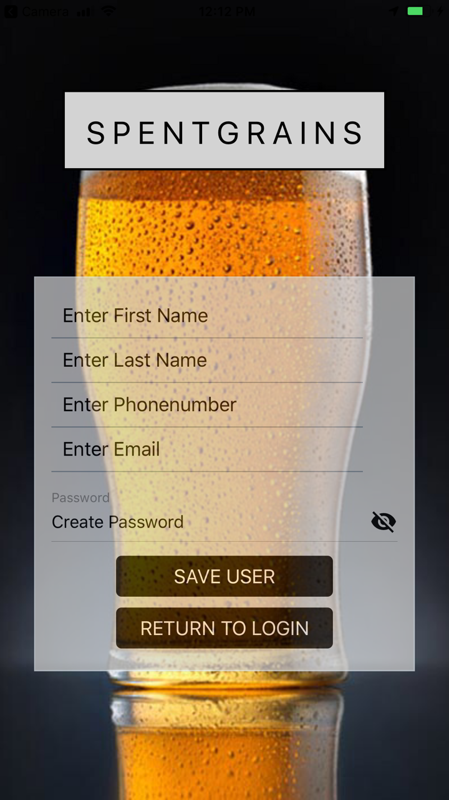
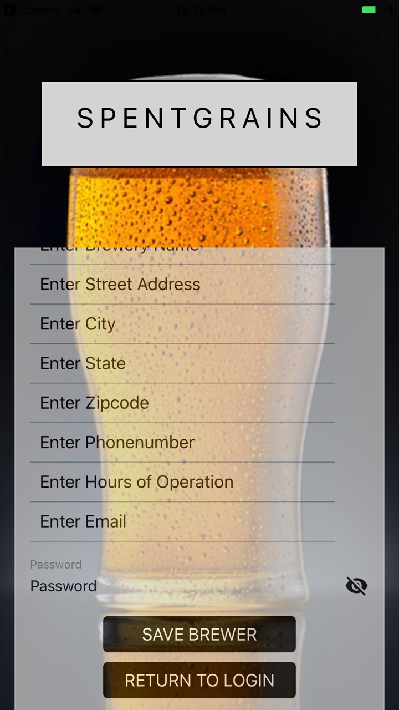
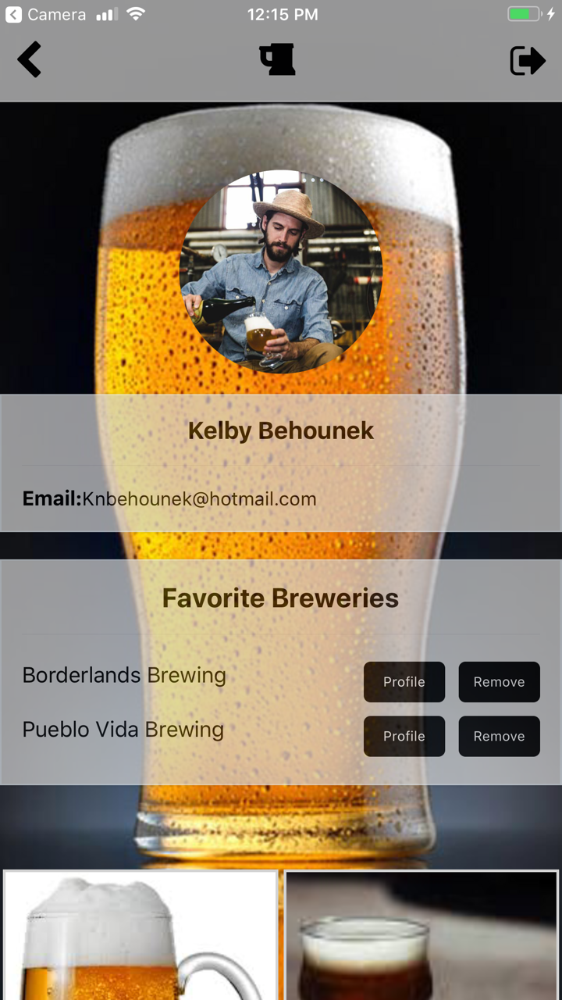
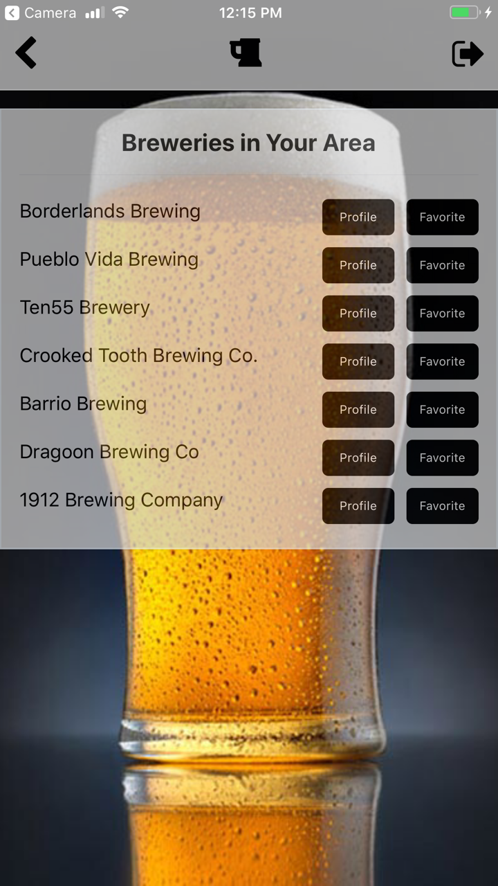
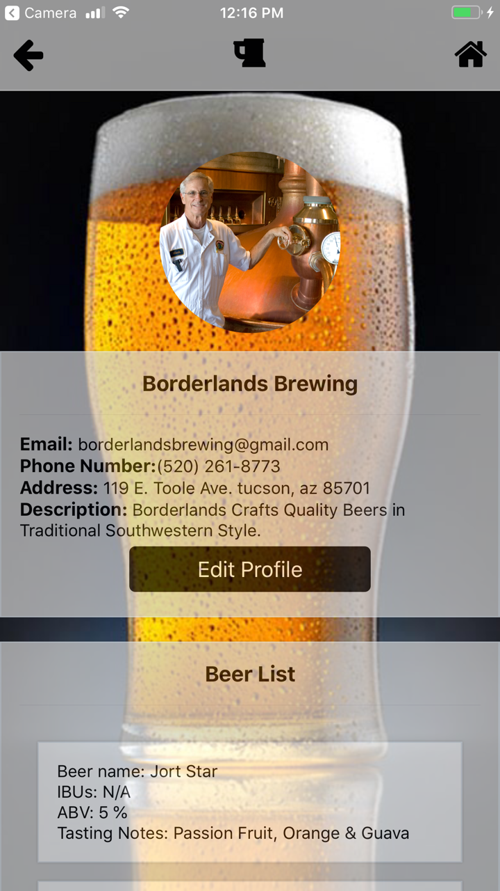

# Spent Grains

We are a small group that, like many others, enjoy a quality craft beer while supporting the local brewers who masterfully create them. So we designed Spent Grains a mobile app to do just that.

# How to get started
1) Clone repo.
2) Run command in Terminal or Gitbash 'npm install'
3) Download Expo to run on Device of choice or Utilize Emulator of choice
    a) ie Nox
4) Run command in Terminal or Gitbash 'expo start'
4) Press 'ctrl + c' to exit the expo Sequence 

# Spent Grains

We are a small group that, like many others, enjoy a quality craft beer while supporting the local brewers who masterfully create them. So we designed Spent Grains a mobile app to do just that.

# How to get started

1) Clone repo.
2) Run command in Terminal or Gitbash 'npm install'
3) Download Expo to run on Device of choice or Utilize Emulator of choice
    a) ie Nox
4) Run command in Terminal or Gitbash 'expo start'
4) Press 'ctrl + c' to exit the expo Sequence 

# APP Functionality
 

1) Login Screen

    a) User Login
    
     
    
    b) User Register -utilize simple on screen inputs and button routes
            
    c) Brewer Login
    
     
    
    d) Brewer Register -utilize simple on screen inputs and button routes
    
         
2) User Session

    a) Upon loggin in as user they will hit home screen
    
     
    
    b) Users can press navigation buttons to move through app
    
      Top left button allows for navigation back to previous page
        
      Middle Button Pulls up lists of Brewers for user to favorite or view profile
      
      
      
      Right Button logs out user returning them to login screen

3) Brewer Session

    a) Upon loggin in as Brewers they will hit their Profile screen along with be given the ability to edit their profile inforamtion and add Drinks to their list.
    
    
    
    b) Brewers can press navigation buttons to move through app
    
      Top left button allows for navigation back to previous page
      
      Middle Button Pulls up lists of Brewers for brewers to view but not edit other brewer profiles
      
      Right Button logs out Brewer returning them to login screen

# Backend Functionality

The backend is a self-made server and database hosted through Heroku and Sequelize that works for the API routes for rendering on the Frontend.

# Technologies used

MySQL
Node.JS
Express.JS
React 

# Supporting Technologies 

React Native
Expo
S3
Fetch
Heroku
Sequelize

# Prerequisites
- Expo or an Emulator like Nox
